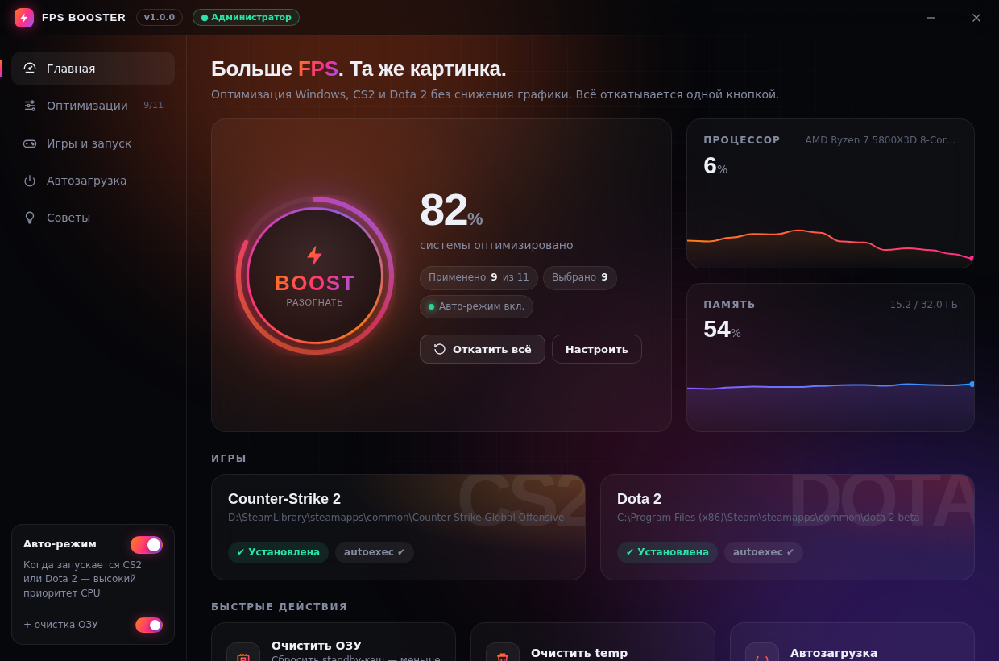

# ⚡ FPS Booster — CS2 & Dota 2

Программа для Windows 10/11, которая поднимает FPS в **Counter-Strike 2** и **Dota 2** и ускоряет весь ПК, **не снижая качество графики**. Ни один пункт не трогает разрешение, текстуры, тени и другие настройки картинки. Все изменения сохраняются в резервную копию и откатываются одной кнопкой.



## Что делает

### Для игр
| Оптимизация | Что даёт |
|---|---|
| Игры всегда на мощной видеокарте | На ноутбуках с двумя GPU игра не запустится по ошибке на встроенной графике. Это самый большой прирост, если такое случалось. |
| Безопасный `autoexec.cfg` | В игре снимается лимит FPS, в меню FPS ограничивается (GPU меньше греется), отключаются подсказки и анимация меню. Ваш конфиг остаётся как был: программа добавляет только свой помеченный блок. |
| Игровой режим Windows | Windows отдаёт игре приоритет и не ставит обновления во время матча. |
| Отключение Xbox Game DVR | Фоновая запись геймплея больше не расходует GPU и диск. |
| **Авто-режим** | Когда запускаются `cs2.exe` или `dota2.exe`, программа ставит им высокий приоритет CPU (не realtime) и может очистить ОЗУ. |

### Для всего ПК
| Оптимизация | Что даёт |
|---|---|
| Схема питания «Максимальная производительность» | Процессор не сбрасывает частоты между кадрами: меньше просадок и фризов. |
| Приоритет игр в планировщике (MMCSS) | Фреймтайм и пинг становятся ровнее. |
| Отключение Power Throttling | Windows перестаёт урезать частоты Steam, Discord и античиту. |
| Запрет фоновой работы приложений Store | Почта, Погода, Xbox и т.п. не расходуют CPU и ОЗУ в фоне. |
| Быстрый интерфейс Windows | Меню открываются без задержки, окна сворачиваются без анимаций. |
| Отключение прозрачности *(выкл. по умолчанию)* | Немного разгружает GPU на рабочем столе. |
| HAGS *(выкл. по умолчанию)* | Аппаратное планирование GPU для видеокарт GTX 10xx+ / RX 5000+. |
| Очистка ОЗУ | Сбрасывает standby-кэш, как это делают RAMMap и ISLC. Помогает от микрофризов, когда памяти мало. |
| Очистка temp | Удаляет временные файлы старше суток. |
| Автозагрузка | Отключает лишние программы при старте Windows, так же как Диспетчер задач. |

Во вкладке «Игры и запуск» лежат готовые параметры запуска Steam с кнопкой «Копировать», а во вкладке «Советы» — что ещё можно сделать вручную (XMP, драйверы, настройки NVIDIA и AMD).

### Чего программа специально не делает
- не понижает графику и разрешение;
- не трогает файлы игры, только стандартный `autoexec.cfg`, поэтому это безопасно для VAC;
- не ставит realtime-приоритет, потому что он может подвесить звук и мышь;
- не отключает Защитник Windows и обновления.

> Прирост FPS зависит от конкретного ПК. Обычно становится меньше просадок и ровнее фреймтайм. Сильнее всего это заметно на ноутбуках и системах, где раньше стояла экономичная схема питания. Самый большой бесплатный прирост часто даёт включённый XMP/EXPO в BIOS (см. «Советы»).

## Как запустить

### Вариант 1: готовый `.exe`
**[⬇ Скачать FPSBooster.exe](../../releases/latest/download/FPSBooster.exe)** (последняя сборка).

GitHub Actions собирает `FPSBooster.exe` при каждом пуше: **Actions → build → Artifacts → FPSBooster**. Если запушить тег `v*`, exe попадёт ещё и в Releases. Запустите файл и подтвердите запрос администратора.

### Вариант 2: собрать самому
1. Установите [Python 3.10+](https://www.python.org/downloads/) и при установке отметьте «Add to PATH».
2. Запустите `build.bat`.
3. Готовый файл появится в `dist\FPSBooster.exe`.

### Вариант 3: из исходников
```bat
pip install -r requirements.txt
python -m fps_booster
```

Интерфейс работает на Edge WebView2, который уже встроен в Windows 10/11.

### Консольный режим
```bat
python -m fps_booster --list              :: список игр и оптимизаций
python -m fps_booster --apply             :: применить рекомендуемые
python -m fps_booster --apply mmcss hags  :: применить выбранные
python -m fps_booster --revert            :: откатить всё
```

## Откат
Кнопка **«Откатить всё»** возвращает исходные значения реестра и прежнюю схему питания, а из `autoexec.cfg` убирает только блок программы. Резервная копия хранится в `%APPDATA%\FPSBooster\backup.json`. Если оптимизацию применить повторно, исходное значение в копии не перезаписывается.

## Разработка
```
fps_booster/
  api.py       мост между интерфейсом и Python (pywebview js_api)
  app.py       окно приложения
  ui/index.html интерфейс (HTML/CSS/JS)
  tweaks.py    оптимизации с бэкапом и откатом
  games.py     поиск Steam, CS2, Dota 2 и работа с autoexec.cfg
  system.py    очистка ОЗУ и temp, автозагрузка
  watcher.py   авто-приоритет для запущенных игр
  vdf.py       парсер форматов Steam (VDF/ACF)
tests/         pytest
```
- Тесты: `pip install psutil pytest && python -m pytest`.
- Дизайн можно смотреть без Windows: откройте `fps_booster/ui/index.html` в браузере, и он запустится в демо-режиме с тестовыми данными.
